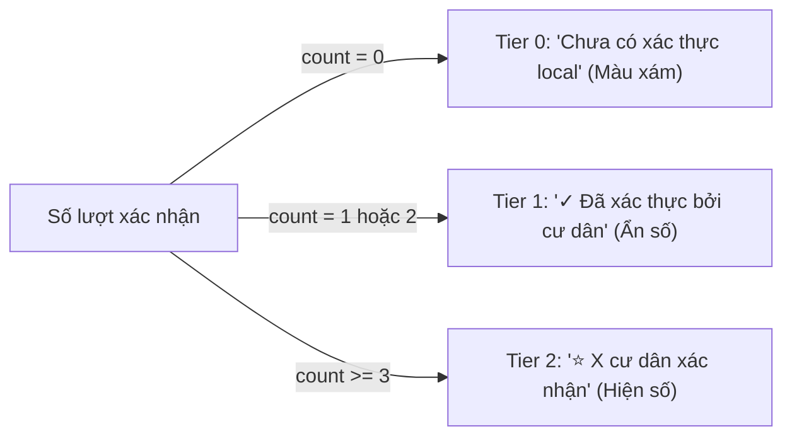

# 📱 Cẩm Nang Tích Hợp Frontend (Flutter / Mobile Integration Guide) — HubLocal

Tài liệu này được biên soạn bởi **Kiến trúc sư Cấp cao & Giám đốc Sản phẩm** dành riêng cho đội ngũ phát triển Mobile (Flutter / React Native / iOS / Android) để kết nối đồng bộ, mượt mà và chuẩn mực với hệ thống Backend HubLocal.

---

## 🧭 1. Thiết Lập Môi Trường Kết Nối (Base URL & Network Setup)

Hệ thống Backend HubLocal được đóng gói toàn diện qua **Docker Compose** (PostgreSQL 16 Alpine + Django REST Framework):

| Môi Trường Chạy App | Base URL API | Ghi Chú |
| :--- | :--- | :--- |
| **iOS Simulator** | `http://localhost:8123/api/v1` | Kết nối trực tiếp máy Mac qua localhost |
| **Android Emulator** | `http://10.0.2.2:8123/api/v1` | IP loopback đặc biệt của Android Emulator |
| **Thiết bị thật (Cùng Wi-Fi)** | `http://<IP_MAY_TINH>:8123/api/v1` | Ví dụ `http://192.168.1.15:8123/api/v1` |
| **Production Server** | `https://api.hublocal.vn/api/v1` | Tên miền chính thức |

### 🔑 Cơ Chế Xác Thực JWT (SimpleJWT)
* Header bắt buộc cho các endpoint yêu cầu đăng nhập:
  ```http
  Authorization: Bearer <access_token>
  Content-Type: application/json
  ```
* **Vòng đời Token:**
  * `access_token`: Có hiệu lực trong **7 ngày**.
  * `refresh_token`: Có hiệu lực trong **30 ngày**.
* **Cơ chế thu hồi (Blacklist):** Khi người dùng chọn "Đăng xuất", ứng dụng **bắt buộc** gọi `POST /auth/logout/` gửi kèm refresh token để hủy phiên hoàn toàn trên máy chủ.

---

## 🛡️ 2. Chuẩn Cấu Trúc Lỗi Toàn Hệ Thống (Unified Error Envelope)

Tất cả các phản hồi lỗi từ server (400, 401, 403, 404, 429, 500) đều tuân thủ chặt chẽ một schema duy nhất:

```json
{
  "code": "ERROR_CODE",
  "message": "Thông báo thân thiện hiển thị cho người dùng",
  "field_errors": {
    "field_name": ["Lý do chi tiết nếu là lỗi validate form"]
  },
  "request_id": "b3e34b9d-4767-4221-8255-75e3c79a9780"
}
```

### Bảng Mã Lỗi Chuẩn (Standard Error Codes)
| Mã `code` | HTTP Status | Diễn Giải & Hành Động Phía Client |
| :--- | :---: | :--- |
| `VALIDATION_ERROR` | 400 | Dữ liệu gửi lên không đúng định dạng. Đọc `field_errors` để hiển thị dưới từng ô Input. |
| `TIP_ALREADY_EXISTS` | 400 | Người dùng đã có mẹo tại địa điểm này. Hiển thị thông báo hoặc mở form sửa mẹo hiện tại. |
| `INVALID_TOKEN` | 400 | Token gửi lên không hợp lệ hoặc đã nằm trong blacklist. Chuyển sang màn đăng nhập. |
| `UNAUTHORIZED` | 401 | Chưa đăng nhập hoặc token đã hết hạn. Kích hoạt refresh token hoặc điều hướng về Login. |
| `REQUIRES_LOCAL_VERIFICATION` | 403 | Tài khoản chưa được duyệt huy hiệu cư dân địa phương. Điều hướng sang Màn hình 3 (Xác minh cư dân). |
| `DISTRICT_MISMATCH` | 403 | Người dùng cố xác nhận một quán không thuộc quận mình cư trú. Hiển thị thông báo giải thích. |
| `NOT_FOUND` | 404 | Địa điểm hoặc mẹo không tồn tại hoặc đã bị xóa. |
| `THROTTLED` | 429 | Thao tác quá nhanh (vượt quá 60 lần/giờ). Thông báo người dùng thử lại sau. |
| `INTERNAL_SERVER_ERROR` | 500 | Lỗi máy chủ. Ghi log kèm `request_id` để gửi đội ngũ kỹ thuật tra cứu. |

---

## 🎨 3. Phân Tầng Tín Nhiệm & Huy Hiệu Local (Trust Tier)

HubLocal **tuyệt đối không dùng đánh giá sao (1-5★)** làm tiêu chí xếp hạng. Mọi quyết định hiển thị trên UI phải dựa vào `trust_tier`:



| Giá trị `trust_tier` | Tên Tầng | Màu Sắc UI | Nội Dung & Cách Render Chuẩn |
| :---: | :--- | :--- | :--- |
| **`0`** | Chưa có xác thực | Xám (`#9CA3AF`) | `Chưa có xác thực local` (Không hiện icon nổi bật) |
| **`1`** | Đã xác thực (1–2 người) | Xanh dương (`#3B82F6`) | `✓ Đã xác thực bởi cư dân` *(Ẩn số lượng để tránh cảm giác app vắng)* |
| **`2`** | Tin cậy cao ($\ge 3$ người) | Xanh ngọc (`#10B981`) | `⭐ 12 cư dân xác nhận` *(Hiển thị số cụ thể)* |

---

## 📱 4. Đặc Tả Chi Tiết Màn Hình & Hợp Đồng API

---

### MÀN HÌNH 1: Khám Phá & Danh Sách Địa Điểm (Explore Screen)

#### UI/UX Specs:
* **Dropdown Khu Vực:** Lấy dữ liệu động từ API `GET /districts/`.
* **Search Bar:** Ô tìm kiếm tên quán/địa chỉ (debounce 300ms).
* **Filter Chips Danh Mục:** Lấy từ API `GET /places/categories/` (`EAT_DRINK`, `PLAY`, `SERVICES`).
* **Trạng Thái & Khoảng Giá:** Hiển thị thẻ giờ mở cửa và khoảng giá (trả về `null` nếu quán chưa có dữ liệu giá).
* **Quanh Đây (Near Me):** Truyền `lat`, `lng`, `radius` để tính `distance_km` và lọc theo bán kính.
* **Nút Bookmark:** Nhấn icon trái tim để Lưu/Bỏ lưu địa điểm realtime.

#### API Endpoints:

##### 1. Lấy danh sách quận/khu vực hỗ trợ:
```http
GET /districts/
```
**Response (200 OK):**
```json
[
  {
    "code": "THU_DUC",
    "name": "Thủ Đức",
    "place_count": 172
  }
]
```

##### 2. Lấy danh sách địa điểm (kèm tìm kiếm & phân trang):
```http
GET /places/?district=Thủ Đức&category=EAT_DRINK&lat=10.835&lng=106.728&radius=5&page=1
```
**Response (200 OK):**
```json
{
  "count": 172,
  "next": "http://localhost:8123/api/v1/places/?page=2",
  "previous": null,
  "results": [
    {
      "id": 173,
      "name": "Tiệm Chuyên Tóc Nam - Tài Barbershop Hiệp Bình - Thủ Đức",
      "category": "SERVICES",
      "category_display": "Dịch vụ",
      "status": "OPEN",
      "status_display": "Đang hoạt động",
      "district": "Thủ Đức",
      "district_code": "THU_DUC",
      "address": "419/2 Đ. Số 48, Hiệp Bình, Hồ Chí Minh",
      "latitude": "10.835047",
      "longitude": "106.728302",
      "cover_image": "",
      "thumbnail_image": "",
      "min_price": null,
      "max_price": null,
      "price_currency": "VND",
      "opening_hours_text": "",
      "google_maps_url": "https://www.google.com/maps/place/...",
      "google_rating": null,
      "google_review_count": 0,
      "trust_tier": 0,
      "trust_tier_display": "Chưa có xác thực local",
      "verified_count": 0,
      "last_verified_at": null,
      "short_tip": "",
      "is_saved": false,
      "distance_km": 0.03
    }
  ]
}
```

##### 3. Lưu / Bỏ lưu địa điểm (Bookmarks - Idempotent):
```http
POST /places/{id}/save/
DELETE /places/{id}/save/
```
**Response POST (201 Created hoặc 200 OK):**
```json
{
  "place_id": 173,
  "is_saved": true,
  "message": "Đã lưu địa điểm vào danh sách yêu thích."
}
```
**Response DELETE (200 OK):**
```json
{
  "place_id": 173,
  "is_saved": false,
  "message": "Đã bỏ lưu địa điểm."
}
```

##### 4. Lấy danh sách địa điểm đã lưu của tôi:
```http
GET /places/saved/?page=1
```
*(Trả về định dạng phân trang chuẩn giống hệt danh sách `/places/`)*

---

### MÀN HÌNH 2: Chi Tiết Địa Điểm (Place Detail Screen)

#### UI/UX Specs:
* **Nút "Tôi cũng biết chỗ này":**
  * Nút to, rõ ràng ở cuối màn hình.
  * Nếu chưa đăng nhập: Mở BottomSheet Đăng nhập.
  * Nếu `can_verify_places == false`: Mở BottomSheet giải thích và dẫn đến Màn hình 3.
  * Nếu đã bấm: Nút chuyển sang trạng thái Disabled màu xanh `✓ Đã xác nhận`.
* **Phần Mẹo từ Cư Dân (HubLocal Tips):**
  * Hiển thị danh sách mẹo ngắn gọn từ cư dân. Tên tác giả được format ẩn danh (`Minh T.`, `0903***123`).
  * Có nút `Sửa mẹo` nếu `is_mine == true`.
* **Khối Dữ Liệu Google Maps:** Tách riêng biệt ở cuối trang để người dùng tham khảo thêm đánh giá bên ngoài.

#### API Endpoints:

##### 1. Chi tiết địa điểm:
```http
GET /places/{id}/
```
**Response (200 OK):**
```json
{
  "id": 173,
  "name": "Tiệm Chuyên Tóc Nam - Tài Barbershop",
  "category": "SERVICES",
  "category_display": "Dịch vụ",
  "status": "OPEN",
  "status_display": "Đang hoạt động",
  "district": "Thủ Đức",
  "district_code": "THU_DUC",
  "address": "419/2 Đ. Số 48, Hiệp Bình, Hồ Chí Minh",
  "latitude": "10.835047",
  "longitude": "106.728302",
  "cover_image": "https://lh3.googleusercontent.com/...",
  "thumbnail_image": "https://lh3.googleusercontent.com/...",
  "photos": [
    "https://lh3.googleusercontent.com/...",
    "https://lh3.googleusercontent.com/..."
  ],
  "min_price": null,
  "max_price": null,
  "price_currency": "VND",
  "price_updated_at": null,
  "opening_hours_text": "",
  "opening_hours_structured": {},
  "data_source": "google_maps",
  "google_maps_url": "https://www.google.com/maps/place/...",
  "google_rating": null,
  "google_review_count": 0,
  "google_reviews": [],
  "google_scraped_at": null,
  "imported_at": "2026-09-26T01:28:00+07:00",
  "trust_tier": 0,
  "trust_tier_display": "Chưa có xác thực local",
  "verified_count": 0,
  "last_verified_at": null,
  "tips": [],
  "user_has_verified": false,
  "is_saved": false,
  "distance_km": null,
  "my_tip": null,
  "created_at": "2026-09-26T01:14:00+07:00",
  "updated_at": "2026-09-27T00:30:00+07:00"
}
```

##### 2. Nút "Tôi cũng biết chỗ này" (Xác thực địa điểm - Idempotent):
```http
POST /places/{id}/verify/
```
**Response (201 Created hoặc 200 OK):**
```json
{
  "place_id": 173,
  "user_has_verified": true,
  "verified_count": 1,
  "trust_tier": 1,
  "last_verified_at": "2026-09-27T01:05:00+07:00"
}
```

##### 3. Đăng / Sửa / Xóa mẹo (Tips):
* **Tạo mẹo mới:** `POST /places/{id}/tip/` `{"content": "Quán đi tầm 14h vắng và mát mẻ."}` (Trả về `201 Created`)
* **Sửa mẹo của mình:** `PUT /places/{id}/tip/` `{"content": "Quán đổi giờ mở cửa từ 7h sáng."}` (Trả về `200 OK`)
* **Xóa mẹo của mình:** `DELETE /places/{id}/tip/` (Trả về `200 OK`)

##### 4. Báo sai thông tin hoặc quán đã đóng cửa:
```http
POST /places/{id}/report/
```
**Request Body:**
```json
{
  "report_type": "CLOSED",
  "description": "Quán này đã trả mặt bằng từ tháng trước."
}
```
*(Các loại `report_type` hợp lệ: `CLOSED`, `WRONG_INFO`, `SPAM`, `OTHER`)*

---

### MÀN HÌNH 3: Xác Thực Cư Dân Local (Resident Verification Flow)

#### UI/UX Specs:
* Giải thích rõ: **HubLocal không tự động cấp huy hiệu chỉ bằng việc tự khai số tháng**.
* Khi người dùng điền SĐT, Khu vực, Thời gian sống $\implies$ Gửi lên server $\implies$ Hệ thống ghi nhận trạng thái `pending` để xác minh.

#### API Endpoints:

##### 1. Lấy thông tin tài khoản & quyền hạn của tôi:
```http
GET /auth/me/
```
**Response (200 OK):**
```json
{
  "id": 3,
  "username": "minh_resident",
  "phone_number": "0908889999",
  "first_name": "Minh",
  "last_name": "Trần",
  "profile": {
    "residing_district": "Thủ Đức",
    "residing_months": 12,
    "verification_status": "unverified",
    "verification_status_display": "Chưa gửi xác thực",
    "is_local_verified": false,
    "verified_at": null,
    "verification_rejected_reason": "",
    "created_at": "2026-09-27T01:06:35+07:00",
    "updated_at": "2026-09-27T01:06:35+07:00"
  },
  "permissions": {
    "can_verify_places": false,
    "can_add_tips": true
  }
}
```

##### 2. Gửi hồ sơ xác minh cư dân:
```http
POST /profile/verify-local/
```
**Request Body:**
```json
{
  "phone_number": "0908889999",
  "residing_district": "Thủ Đức",
  "residing_months": 12
}
```
**Response (200 OK):**
```json
{
  "verification_status": "pending",
  "verification_status_display": "Đang chờ xác minh",
  "is_local_verified": false,
  "residing_district": "Thủ Đức",
  "residing_months": 12,
  "message": "Hồ sơ xác minh cư dân đã được tiếp nhận và chuyển sang trạng thái chờ duyệt. HubLocal tuyệt đối không cấp huy hiệu tự động để bảo đảm uy tín của cộng đồng."
}
```

##### 3. Đăng xuất an toàn:
```http
POST /auth/logout/
```
**Request Body:**
```json
{
  "refresh": "<refresh_token_chuỗi_dài>"
}
```
**Response (200 OK):**
```json
{
  "message": "Đăng xuất thành công, phiên làm việc đã được đóng an toàn."
}
```

---

## 🛠️ 5. Mẫu Dart Model Khuyến Nghị Cho Flutter

```dart
enum TrustTier {
  unverified(0),
  verified(1),
  highTrust(2);

  final int value;
  const TrustTier(this.value);

  static TrustTier fromInt(int val) {
    return TrustTier.values.firstWhere(
      (e) => e.value == val,
      orElse: () => TrustTier.unverified,
    );
  }
}

class PlaceModel {
  final int id;
  final String name;
  final String category;
  final String categoryDisplay;
  final String status;
  final String district;
  final String address;
  final double? latitude;
  final double? longitude;
  final String coverImage;
  final String thumbnailImage;
  final List<String> photos;
  final int? minPrice;
  final int? maxPrice;
  final String openingHoursText;
  final TrustTier trustTier;
  final int verifiedCount;
  final String? shortTip;
  final bool isSaved;
  final double? distanceKm;

  PlaceModel({
    required this.id,
    required this.name,
    required this.category,
    required this.categoryDisplay,
    required this.status,
    required this.district,
    required this.address,
    this.latitude,
    this.longitude,
    required this.coverImage,
    required this.thumbnailImage,
    required this.photos,
    this.minPrice,
    this.maxPrice,
    required this.openingHoursText,
    required this.trustTier,
    required this.verifiedCount,
    this.shortTip,
    required this.isSaved,
    this.distanceKm,
  });

  factory PlaceModel.fromJson(Map<String, dynamic> json) {
    return PlaceModel(
      id: json['id'],
      name: json['name'] ?? '',
      category: json['category'] ?? '',
      categoryDisplay: json['category_display'] ?? '',
      status: json['status'] ?? 'OPEN',
      district: json['district'] ?? '',
      address: json['address'] ?? '',
      latitude: json['latitude'] != null ? double.tryParse(json['latitude'].toString()) : null,
      longitude: json['longitude'] != null ? double.tryParse(json['longitude'].toString()) : null,
      coverImage: json['cover_image'] ?? '',
      thumbnailImage: json['thumbnail_image'] ?? '',
      photos: (json['photos'] as List<dynamic>?)?.map((e) => e.toString()).toList() ?? [],
      minPrice: json['min_price'] != null ? int.tryParse(json['min_price'].toString()) : null,
      maxPrice: json['max_price'] != null ? int.tryParse(json['max_price'].toString()) : null,
      openingHoursText: json['opening_hours_text'] ?? '',
      trustTier: TrustTier.fromInt(json['trust_tier'] ?? 0),
      verifiedCount: json['verified_count'] ?? 0,
      shortTip: json['short_tip'],
      isSaved: json['is_saved'] ?? false,
      distanceKm: json['distance_km'] != null ? double.tryParse(json['distance_km'].toString()) : null,
    );
  }
}
```
