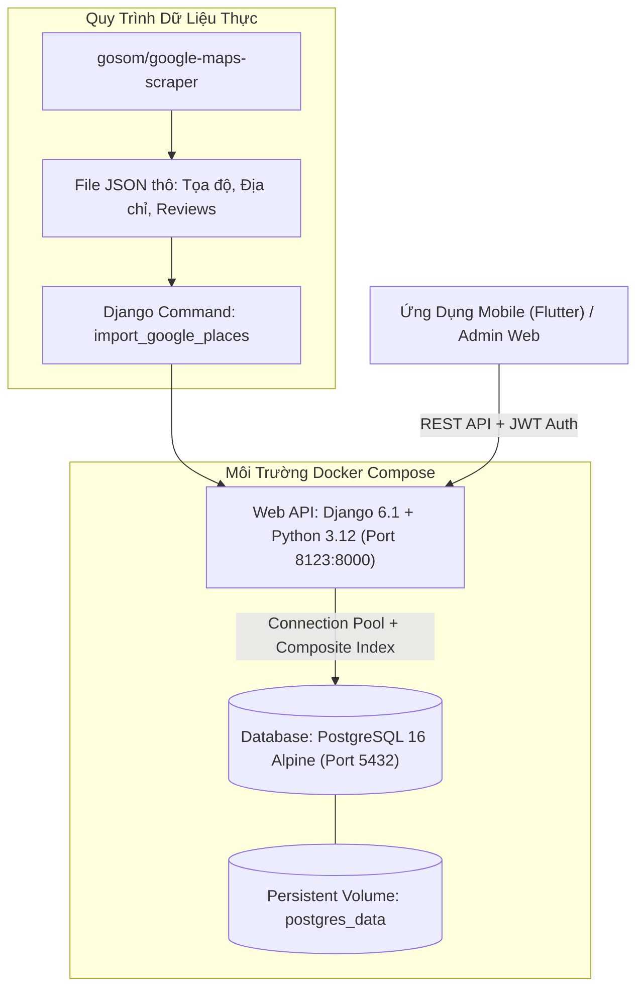
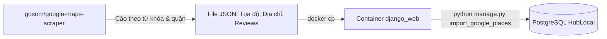

# 📍 HubLocal Backend — Nền Tảng Khám Phá Địa Điểm Cư Dân Địa Phương

HubLocal là hệ sinh thái Backend & REST API cung cấp dữ liệu địa điểm ăn uống, vui chơi và dịch vụ được **đối chiếu giữa dữ liệu thực tế từ Google Maps và các mẹo (Tips) độc quyền từ cư dân sinh sống tại địa phương**.

Hệ thống được thiết kế theo tiêu chuẩn **Senior System Architecture & Product Management**: tối ưu hiệu năng cao, cơ chế phân tầng tín nhiệm (Trust Tier), bảo vệ bản quyền dữ liệu và đóng gói hoàn chỉnh bằng Docker Compose.

---

## 🏛️ Kiến Trúc Hệ Thống (Architecture Overview)



### Điểm Nổi Bật Về Kỹ Thuật:
* **Framework:** Python 3.12, Django 6.1, Django REST Framework.
* **Database:** PostgreSQL 16 Alpine với Composite Index `['district', 'category', '-verified_count']`.
* **Containerization:** Docker multi-stage / slim image, Docker Compose tích hợp PostgreSQL Healthcheck tự động.
* **Xác thực:** SimpleJWT (Access Token 7 ngày, Refresh Token 30 ngày).
* **Bảo vệ dữ liệu nguồn:** Tách riêng `google_reviews` (tham khảo) và `tips` (độc quyền HubLocal); ghi nhận chính xác `google_scraped_at` (thời điểm cào gốc) và `imported_at` (thời điểm nạp hệ thống).
* **Chống gian lận:** Xác thực khớp quận cư trú (`DISTRICT_MISMATCH`), phân tầng tín nhiệm độc lập (`Tier 0`, `Tier 1`, `Tier 2`).

---

## 🚀 Hướng Dẫn Cài Đặt & Khởi Động Nhanh (Quick Start)

### 1. Yêu Cầu Môi Trường (Prerequisites)
* Đã cài đặt **Docker** và **Docker Compose** (Docker Desktop trên Mac/Windows hoặc Colima/Docker Engine trên Linux).
* Cổng mạng trống:
  * Port **`8123`** trên host (map vào port `8000` của Django container).
  * Port **`5432`** trên host (PostgreSQL).

### 2. Cấu Hình Biến Môi Trường
Sao chép file cấu hình mẫu `.env.example` thành `.env`:
```bash
cp .env.example .env
```
Nội dung file `.env` mặc định:
```env
DEBUG=1
SECRET_KEY=django-insecure-hublocal-secret-key-change-in-production-2026
ALLOWED_HOSTS=localhost,127.0.0.1,0.0.0.0,web

WEB_PORT=8123

DB_NAME=django_db
DB_USER=django_user
DB_PASSWORD=django_pass
DB_HOST=db
DB_PORT=5432
```

### 3. Khởi Động Hệ Thống Bằng Docker Compose
Chạy lệnh build image và kích hoạt container ngầm:
```bash
docker compose up --build -d
```
Kiểm tra trạng thái container đang chạy:
```bash
docker compose ps
```
*Kết quả kỳ vọng:* Cả `postgres_db` (healthy) và `django_web` (running) đều ở trạng thái hoạt động.

### 4. Áp Dụng Database Migrations
Khởi tạo bảng và cấu trúc schema trên PostgreSQL 16:
```bash
docker compose exec web python manage.py migrate
```

### 5. Tạo Tài Khoản Quản Trị (Superuser)
Tạo tài khoản quản trị để đăng nhập Django Admin:
```bash
docker compose exec web python manage.py createsuperuser
```
*(Hoặc tạo nhanh qua script mẫu: username: `admin`, password: `admin123456`)*

### 6. Truy Cập Hệ Thống
* 📚 **Tài liệu Swagger API:** [http://localhost:8123/swagger/](http://localhost:8123/swagger/)
* 📖 **Tài liệu ReDoc:** [http://localhost:8123/redoc/](http://localhost:8123/redoc/)
* ⚙️ **Django Admin Dashboard:** [http://localhost:8123/admin/](http://localhost:8123/admin/)
* 🔌 **API Danh sách địa điểm:** [http://localhost:8123/api/v1/places/?district=Thủ Đức](http://localhost:8123/api/v1/places/?district=Thủ Đức)

---

## 📡 Danh Mục API Chính (API Endpoints Reference)

| Phương thức | Đường dẫn Endpoint | Quyền hạn | Mô tả |
| :--- | :--- | :--- | :--- |
| `POST` | `/api/v1/auth/register/` | Public | Đăng ký tài khoản mới & sinh JWT token |
| `POST` | `/api/v1/auth/login/` | Public | Đăng nhập lấy access/refresh token |
| `POST` | `/api/v1/auth/refresh/` | Public | Làm mới Access token |
| `GET/PUT` | `/api/v1/profile/` | Authenticated | Xem và cập nhật hồ sơ cư dân |
| `POST` | `/api/v1/profile/verify-local/` | Authenticated | Gửi thông tin thời gian cư trú (Màn hình 3) |
| `GET` | `/api/v1/places/` | Public | Danh sách địa điểm (lọc theo `district`, `category`, `search`, phân trang) |
| `GET` | `/api/v1/places/{id}/` | Public | Xem chi tiết quán, mẹo cư dân và review Google |
| `GET` | `/api/v1/places/categories/` | Public | Lấy danh sách danh mục phục vụ Filter Chips |
| `POST` | `/api/v1/places/{id}/verify/` | Authenticated | Xác nhận địa điểm (chỉ dành cho cư dân cùng quận) |
| `POST/PUT/DELETE` | `/api/v1/places/{id}/tip/` | Authenticated | Đăng / sửa / xóa mẹo của chính mình |

---

## 🔄 Quy Trình Thu Thập & Nạp Dữ Liệu Thật (Data Ingestion)

HubLocal sử dụng quy trình nạp dữ liệu chuẩn xác, **tuyệt đối không dùng dữ liệu giả lập (No Mock Data)**:



### Bước 1: Chạy Scraper lấy dữ liệu Google Maps thật
Sử dụng Docker image `gosom/google-maps-scraper` với danh sách từ khóa khu vực mong muốn:
```bash
printf "quán ăn Làng Đại Học Thủ Đức\ncà phê Thủ Đức\ntiệm sửa xe Thủ Đức\n" | \
docker run -i --rm gosom/google-maps-scraper:latest \
  -input /dev/stdin \
  -results stdout \
  -json -depth 1 -lang vi -c 1 > thuduc_places.json
```

### Bước 2: Nạp dữ liệu vào database HubLocal
Copy file kết quả vào container và kích hoạt command nhập liệu:
```bash
docker cp thuduc_places.json django_web:/app/thuduc_places.json
docker compose exec web python manage.py import_google_places /app/thuduc_places.json --district "Thủ Đức"
```

### Đặc tính an toàn của lệnh nạp:
1. **Chống trùng lặp (Idempotent):** Ưu tiên đối chiếu theo `google_place_id`, sau đó đến `google_maps_url`. Chạy lại cùng file chỉ cập nhật dữ liệu nguồn, không tạo quán trùng.
2. **Bảo vệ Mẹo HubLocal:** Tuyệt đối không ghi đè hoặc xóa các mẹo (`tips`) mà cư dân HubLocal đã đóng góp.
3. **Giữ đúng thời điểm:** `google_scraped_at` giữ nguyên mốc thời gian cào từ file; `imported_at` lưu chính xác lúc dữ liệu được nạp vào server.

---

## 🧪 Kiểm Thử Tự Động (Automated Testing)

Toàn bộ nghiệp vụ (xác thực cư trú, phân tầng tín nhiệm, chống xác thực chéo quận, ràng buộc unique tip, nạp dữ liệu) đều được bao phủ bởi bộ Integration Test:

```bash
docker compose exec web python manage.py test
```
*Kết quả:* **9/9 test cases PASS (100% OK)**.

---

## 🛠️ Các Lệnh Vận Hành Thường Dùng (Operations Guide)

### Xem Logs Thời Gian Thực:
```bash
docker compose logs -f web
docker compose logs -f db
```

### Khởi Động Lại Hệ Thống:
```bash
docker compose restart web
```

### Backup Cơ Sở Dữ Liệu PostgreSQL:
```bash
docker compose exec db pg_dump -U django_user -d django_db > backup_$(date +%Y%m%d_%H%M%S).sql
```

### Khôi Phục (Restore) Database:
```bash
docker compose exec -T db psql -U django_user -d django_db < backup_file.sql
```

### Tắt Hệ Thống (Giữ nguyên dữ liệu volume):
```bash
docker compose down
```

### Tắt và Xóa Toàn Bộ Volume Dữ Liệu (Reset hoàn toàn):
```bash
docker compose down -v
```

---

## 🌐 Hướng Dẫn Triển Khai Production (Cloud / VPS)

Khi đưa hệ thống lên máy chủ thực tế (DigitalOcean, AWS EC2, VPS Ubuntu):
1. **Thiết lập biến môi trường production trong `.env`:**
   ```env
   DEBUG=0
   SECRET_KEY=khoa-bi-mat-dai-hon-50-ky-tu-ngau-nhien-cuc-ky-bao-mat
   ALLOWED_HOSTS=api.hublocal.vn,your-server-ip
   ```
2. **Cấu hình Web Server Gunicorn / Uvicorn & Nginx:**
   * Sử dụng Gunicorn làm WSGI Application Server bên trong container.
   * Cài đặt Nginx làm Reverse Proxy bên ngoài máy chủ để xử lý SSL/HTTPS (Let's Encrypt Certbot) và phục vụ static files:
     ```nginx
     server {
         server_name api.hublocal.vn;

         location / {
             proxy_pass http://127.0.0.1:8123;
             proxy_set_header Host $host;
             proxy_set_header X-Real-IP $remote_addr;
             proxy_set_header X-Forwarded-For $proxy_add_x_forwarded_for;
             proxy_set_header X-Forwarded-Proto $scheme;
         }

         location /static/ {
             alias /Volumes/Code/SourceCode/self_project/hublocal/staticfiles/;
         }
     }
     ```
3. **Thu thập Static Files:**
   ```bash
   docker compose exec web python manage.py collectstatic --noinput
   ```

---

## 🛠️ Cổng Quản Trị Cư Dân & Vận Hành (Admin Portal)

Hệ thống quản trị Django Admin tại URL `/admin/` được nâng cấp toàn diện phục vụ đội ngũ vận hành HubLocal:

### 1. Phê Duyệt Cư Dân 1-Click (`/admin/users/userprofile/`):
* **Huy hiệu trực quan:** Phân biệt trạng thái `⏳ Chờ phê duyệt` (Vàng), `● Đã xác thực` (Xanh lá), `✕ Bị từ chối` (Đỏ).
* **Nút bấm 1-click:** Nút `[Duyệt]` và `[Từ chối]` trực tiếp ngay trên danh sách.
* **Bulk Actions:** Chọn nhiều cư dân để duyệt hoặc từ chối hàng loạt.
* **Tự động kích hoạt Push Notification:** Ngay khi tài khoản được duyệt hoặc từ chối, hệ thống gửi thông báo Push FCM và thông báo in-app đến điện thoại của người dùng kèm lý do chi tiết.

### 2. Quản Lý Báo Cáo Địa Điểm (`/admin/places/placereport/`):
* Tiếp nhận và phân loại phản ánh từ người dùng: `Quán đóng cửa`, `Sai lệch thông tin`, `Spam`.
* Actions 1-click: `Đánh dấu Đã xử lý (RESOLVED)` hoặc `Bác bỏ (DISMISSED)`.

### 3. Giám Sát Thiết Bị & Push Notifications (`/admin/notifications/`):
* **Device Tokens:** Quản lý FCM Registration Tokens của thiết bị di động (Android / iOS / Web).
* **Hộp thư thông báo:** Lịch sử gửi, phân loại payload (`VERIFICATION_APPROVED`, `PLACE_TIER_UPGRADED`, `SYSTEM`), trạng thái đã đọc và action `Gửi lại Push`.

---

## 👥 Đóng Góp & Quản Trị
* **Tác giả:** Đội ngũ Kỹ thuật & Sản phẩm HubLocal.
* **Liên hệ:** `contact@hublocal.vn`
